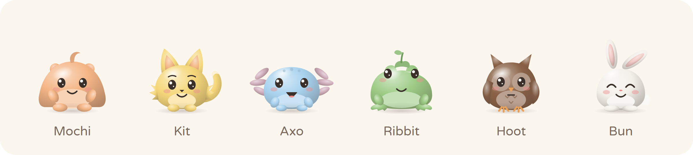
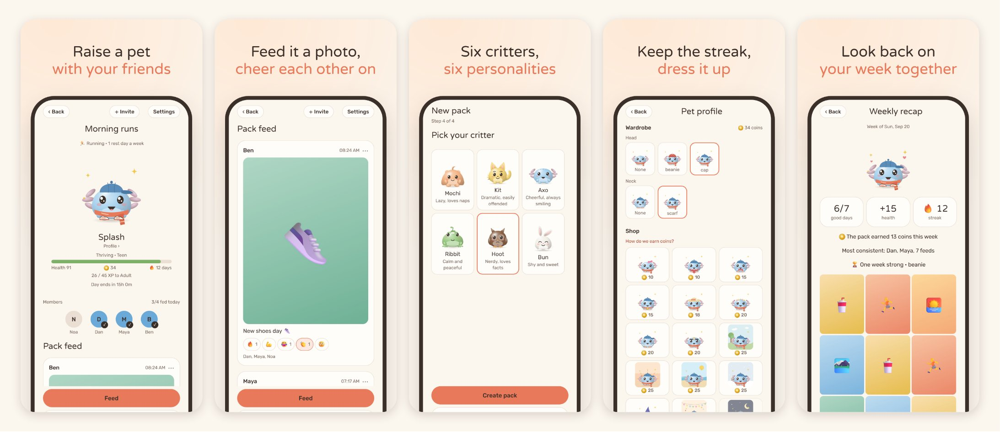
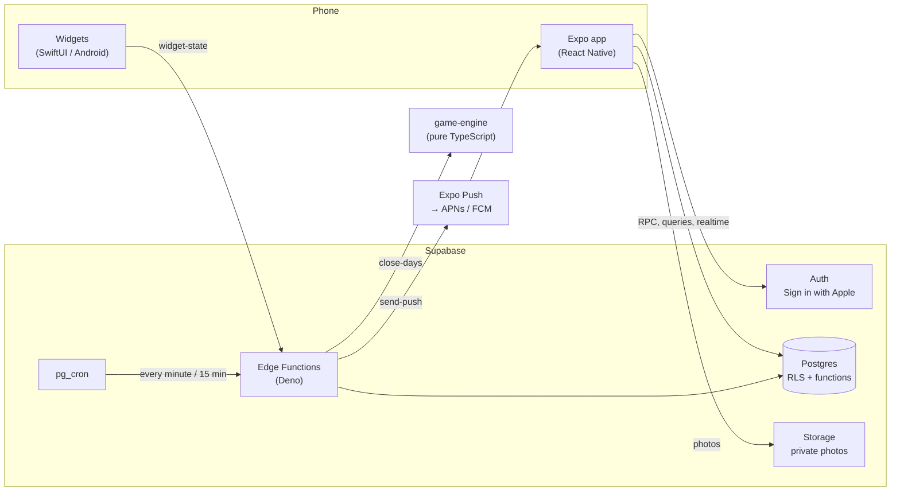

<p align="center">
  
</p>

<h1 align="center">Gozali</h1>

<p align="center">
  <b>Raise a pet with your friends.</b><br>
  A habit app where a small group keeps one shared critter alive by doing their habit every day and proving it with a photo.
</p>

<p align="center">
  <a href="https://github.com/Arielkuznets/gozali/actions/workflows/ci.yml"></a>
  <a href="https://github.com/Arielkuznets/gozali/actions/workflows/native.yml"></a>
  
  
  
</p>

<p align="center">
  <a href="https://gozali.app">gozali.app</a> ·
  <a href="docs/product-spec.md">Product spec</a> ·
  <a href="docs/decisions.md">Decision log</a> ·
  <a href="docs/setup.md">Setup</a>
</p>

<p align="center">
  
</p>

Gozali (Hebrew for "my little chick") turns a habit into a pet you raise together. A pack of 2 to 8 friends shares a habit, like the gym, reading or running. Every day each of them does it and takes a photo in the app, and the photo feeds the pack's critter. Keep going and it hatches, grows and earns coins for outfits; stop, and it gets weak and runs off to find food. It never dies.

## How it works

- **Feed it with a photo.** Photos are taken in the app only, seen only by the pack, and deleted after 30 days.
- **Do it together.** A day succeeds when the pack keeps up; in packs of 5 or more one miss is allowed, so bigger packs aren't punished (checked with a simulator).
- **Life happens.** Weekly rest days, a monthly joker and pauses for trips. A member who keeps missing falls asleep instead of dragging everyone down.
- **Grow and dress up.** An egg hatches on the first day two members feed it. Good days earn XP and coins; streaks earn more; achievements unlock special items.
- **Stay in touch.** Reactions, nudges, a monthly board, a weekly recap to share as a story, reminders in the critter's own voice, and home screen widgets.

## Architecture



The app is thin on purpose: every decision that matters (whether a feed counts, how a day went, who may see a photo) is made on the server, where it can't be tampered with.

**One feed, end to end:** the photo is compressed on the phone and uploaded to private storage → `submit_feed` checks membership and the upload and saves the feed for the pack's day (days end at 03:00) → a trigger writes "friend fed" notifications to an outbox table → `send-push` claims them every minute, applies quiet hours and a daily limit, and sends them through Expo Push → at the end of the day `close-days` runs the game engine and applies the result in one transaction: health, streak, XP, coins, hatching, achievements.

## Tech stack

| Layer | Technology | Why |
| --- | --- | --- |
| Mobile app | [Expo](https://expo.dev) SDK 57, React Native 0.86, React 19, Expo Router | One TypeScript codebase for iOS and Android; native config generated from `app.json` |
| Data in the app | TanStack Query, Supabase Realtime | Caching, refetch on focus, optimistic reactions, live updates |
| Animation and art | Reanimated, react-native-svg | The critters are drawn in code as SVG and animated on the UI thread |
| Widgets | SwiftUI (WidgetKit, App Group), react-native-android-widget | The pet and who fed today on the home and lock screen |
| Backend | [Supabase](https://supabase.com): Postgres 17, Auth, Storage, Edge Functions (Deno) | Authorization in the database with row level security; actions as security definer functions |
| Scheduling | pg_cron, pg_net, Vault | Day close, push sending, daily summary and clean-up run inside the database |
| Game rules | `packages/game-engine`, dependency-free TypeScript | Pure functions: the same code runs on the server, in the tests and in the simulator |
| Delivery | EAS Build, Submit and Update; GitHub Actions | Cloud builds for the stores, over-the-air JavaScript updates, CI on every push |
| Website | Cloudflare (static assets, DNS, Email Routing) | Landing, invite links (universal links), privacy, terms, support |

## Engineering highlights

- **Rules first.** The product spec and a [decision log](docs/decisions.md) of 22 decisions came before the code, and a [simulator](docs/simulation.md) ran thousands of packs to tune the rules until they were fair at every pack size.
- **Authorization in Postgres.** Every table has row level security. Users change state only through functions that check the caller and their membership, and even photo files are readable only through a feed the viewer is allowed to see.
- **Reliable by construction.** Notifications go through an outbox written in the same transaction as the action. The day close is state-based and idempotent: it catches up on any missed days in order, and a day the service was down can't fail. Purchases and joins lock the rows they depend on.
- **Time zones done right.** Each pack has its own day, ending at 03:00 on its clock. The engine and the database were checked against each other at 2,042 moments across daylight saving changes in six time zones.
- **Privacy and moderation.** Reports, blocking, automatic hiding after three reports and an email to the developer; full account deletion inside the app; photos deleted after 30 days; no ads, no tracking, no analytics SDKs.
- **Operations.** Error reports from phones, a daily summary push to the owner (sign-ups, activity, server errors, outages), rate limits, retention jobs, a forced-update switch, and a daily backup script with a tested restore.

## Testing

| Layer | Tool | Tests |
| --- | --- | --- |
| Game rules and art | `node:test` | 71 |
| App logic | Jest | 39 |
| Database: permissions, functions, triggers | [pgTAP](https://pgtap.org) | 276 |
| Whole flows against a local stack | Node smoke scripts | 7 |
| The app in a browser, like a user | [Playwright](https://playwright.dev) | 18 |
| Native builds | GitHub Actions: iOS on macOS, Android build and a launch on an emulator | 3 jobs |

## Repository

```
apps/mobile            The Expo app: screens (src/app), features, components, widgets (targets/widget for iOS)
packages/game-engine   The game rules, the simulator
packages/critter-art   The six critters as SVG, their outfits, the app icons
supabase/migrations    The schema, row level security and functions, one migration at a time
supabase/functions     Edge Functions: close-days, send-push, on-report, delete-account, widget-state
supabase/tests         pgTAP tests
e2e                    Playwright tests, store screenshots and a screen gallery
scripts                Smoke tests, backup and restore
web                    The gozali.app site
docs                   Product spec, decisions, simulation, setup, store listing, legal
```

## Getting started

Needs Node 24+ and Docker. The app runs against a local Supabase stack.

```sh
npm install                 # npm workspaces, once at the root
npx supabase start          # local Supabase in Docker
npm run typecheck && npm test && npm run db:test
```

<details>
<summary>All the commands</summary>

```sh
npx supabase start     # local Supabase in Docker
npm run db:test        # pgTAP tests in supabase/tests
npm run db:types       # regenerate apps/mobile/src/lib/database.types.ts
npm run smoke:packs    # pack flow against local Supabase (needs SUPABASE_PUBLISHABLE_KEY and SUPABASE_SECRET_KEY)
npm run smoke:critter  # a critter change reaches pack members live, and only them (same keys)
npm run smoke:feeds    # upload, feed, live update and photo access for members only (same keys)
npm run smoke:day-close  # days closed by the real close-days code: hatching, joker, sleep, an outage (same keys)
npm run smoke:push       # friend-fed merging, "last one", the critter's lines, owner alerts and dead tokens
npm run smoke:widgets    # the widget token and endpoint (needs `npx supabase functions serve`)
npm run smoke:delete-account  # account deletion end to end, and Sign in with Apple revocation (needs `npx supabase functions serve`)
npm run functions:bundle       # bundle every Edge Function with the deploy bundler (Docker)
```

```sh
# End-to-end tests: the web build in a phone-sized browser against local Supabase (same keys).
# apps/mobile/.env must point at the local stack (API_URL and PUBLISHABLE_KEY from `npx supabase status`).
npm run e2e:build                  # export the web app to apps/mobile/web-build
npx playwright install chromium    # once; or set E2E_BROWSER_CHANNEL=msedge to use an installed Edge
npm run e2e                        # tests in e2e/
npm run store:shots                # the App Store and Google Play screenshots
npm run ui:gallery                 # every screen at two phone sizes, for review
```

```sh
# The scheduled functions locally: put CRON_SECRET=<any value> in supabase/functions/.env, then
npx supabase functions serve
curl -X POST -H "x-cron-secret: <value>" http://127.0.0.1:54321/functions/v1/close-days
curl -X POST -H "x-cron-secret: <value>" http://127.0.0.1:54321/functions/v1/send-push
```

```sh
cd packages/game-engine
npm test            # unit tests (node:test)
npm run typecheck   # tsc, fetched on demand
npm run sim         # simulator, see docs/simulation.md
```

```sh
cd packages/critter-art
npm test                           # every combination renders valid SVG
npm run preview -- critters.html   # contact sheet of all states, stages and items
npm run icons                      # redraw the app icons in apps/mobile/assets/images from the critter
npm run holidays                   # regenerate the holiday-hat dates from the Hebrew calendar
```

```sh
cd web && npx wrangler deploy      # publish gozali.app (after `node web/build.mjs`)
node scripts/backup.mjs            # back up the cloud database's data to ~/Gozali backups
```

</details>

## Docs

- [Product spec](docs/product-spec.md): the rules, screens, notifications, data model and build plan
- [Decision log](docs/decisions.md): what was decided and why
- [Simulation results](docs/simulation.md): how the rules were tuned
- [Setup](docs/setup.md): Supabase, EAS builds, sign-in, the site, backups and operations
- [Store listing](docs/store-listing.md): store texts, privacy answers and notes for App Review
- [Privacy policy](docs/legal/privacy-policy.md), [terms of use](docs/legal/terms-of-use.md) and [support](docs/support.md)

## Status

Version 1.0 for iPhone is in App Review. Android is built and tested in CI, and comes next.

## License

Copyright © 2026 Ariel Kuznets. All rights reserved. The source is public to read; it is not licensed for reuse or redistribution.
